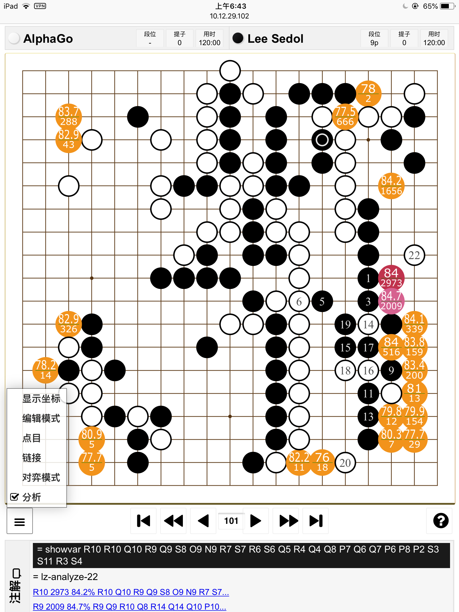

# Webgo

# Introduction
Using web browser to visit game go AI program in remote computer.
Remote computer can be personal computer or cloud compute service, now Webgo server part can support leela zero in windows, mac or linux and support Zen6,Zen7 in windows.
Then you can play game or analyze kifu with AI.



# Acknowledge and Dependency
1. Web page based on [WGo.js](https://github.com/waltheri/wgo.js).
2. Server side based on [Leela Analysis Scripts](https://github.com/lightvector/leela-analysis)
3. Server side depends on Python module: bottle, gevent and gevent-websocket
4. Also use some [Sabaki](https://github.com/SabakiHQ/Sabaki) theme, which is my favorite go UI
5. Thanks hzy's strongest 4b32f leela-zero weights, I put it together with windows release package

# Using Webgo in Windows
1. Download [release](https://github.com/zliu1022/Webgo/releases/download/v0.3/Webgo-20190319.7z) package and Unzip
2. Click start.bat
3. Visit page according to console message
Here is an example:
```
please enter URL: http://192.168.1.66:8000/webgo.html
```

# Using Webgo in mac
1. Compile and run leelazero, please refer to readme of [leela-zero](https://github.com/leela-zero/leela-zero/blob/master/README.md)
```
ruby -e "$(curl -fsSL https://raw.githubusercontent.com/Homebrew/install/master/install)"
brew install boost
git clone -b next https://github.com/gcp/leela-zero.git
Compile leelaz
get weight
```
2. install Webgo
```
sudo easy_install pip
sudo pip install bottle
pip install --user greenlet
pip install --user gevent
pip install --user gevent-websocket
```
If failed, maybe need to install pyenv, then using pyenv to install another version python
pyenv global 2.7.11 to switch version, but wish you lucky
```
mkdir github
cd github
git clone https://github.com/zliu1022/Webgo.git -b next Webgo-next
cd Wegbo-next
mkdir dist
```
3. Config engine and weights
```
cp leelaz ~/github/Webgo/dist/leelaz
cp network.gz ~/github/Webgo/dist/network.gz
```
4. run server and open firewall's corresponding port
```
python svr/webgo.py
```

# Using Webgo in google cloud
1. Compile and run leelazero, please refer to readme of [leela-zero](https://github.com/leela-zero/leela-zero/blob/master/README.md)
2. Install Webgo
```
sudo apt install python-minimal
sudo apt install python-pip
pip install bottle gevent gevent-websocket
mkdir github
cd github
git clone https://github.com/zliu1022/Webgo.git -b next Webgo-next
cd Wegbo-next
mkdir dist
```
3. Config engine and weights
```
cp leelaz ~/github/Webgo/dist/leelaz
cp network.gz ~/github/Webgo/dist/network.gz
```
4. run server and open firewall's corresponding port
```
python svr/webgo.py
```

# Server Configuration
Change the command line option in leelaz.py
```
xargs = ['-t8', '--gpu', '0', '--gpu', '1']
```

# License
The code is released under the AGPLv3 or later.
